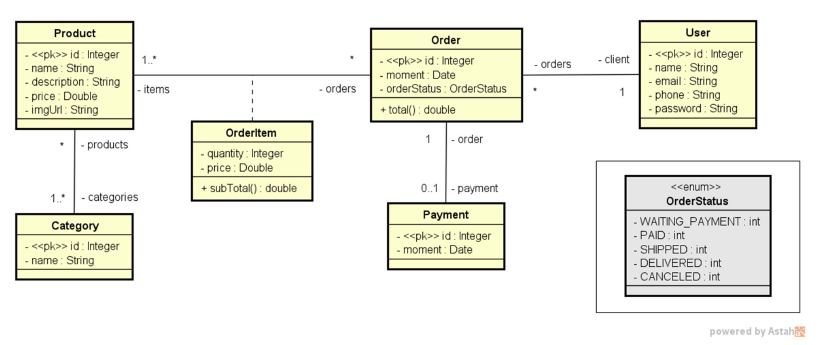

# Web services com Spring Boot e JPA/Hibernate

# Sobre o projeto
Web service com Spring Boot e JPA/Hibenate é uma aplicação Backend construída durante o curso de Java Completo 2023 do site Udemy, aplicado pelo professor Nelio Alves.

A aplicação consiste em uma simulação de vendas de produtos com pedidos e usuários, onde o backend é dividido em camadas (Controladores, servicos e dados) que conversão
com as entidades.

## Modelo conceitual

# Tecnologia utilizadas
- Java
- Spring Boot
- JPA / Hibernate
- Marven
- H2
- Postman
